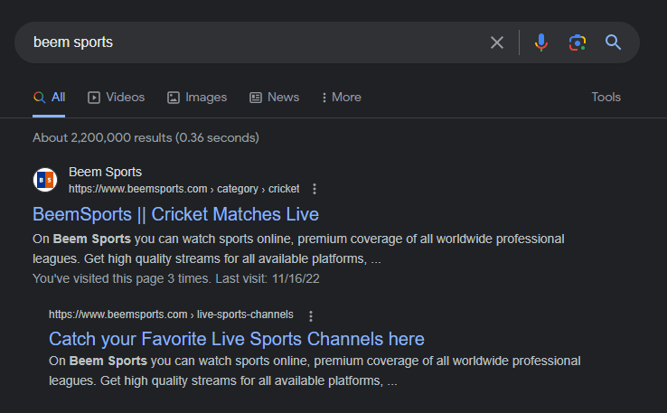
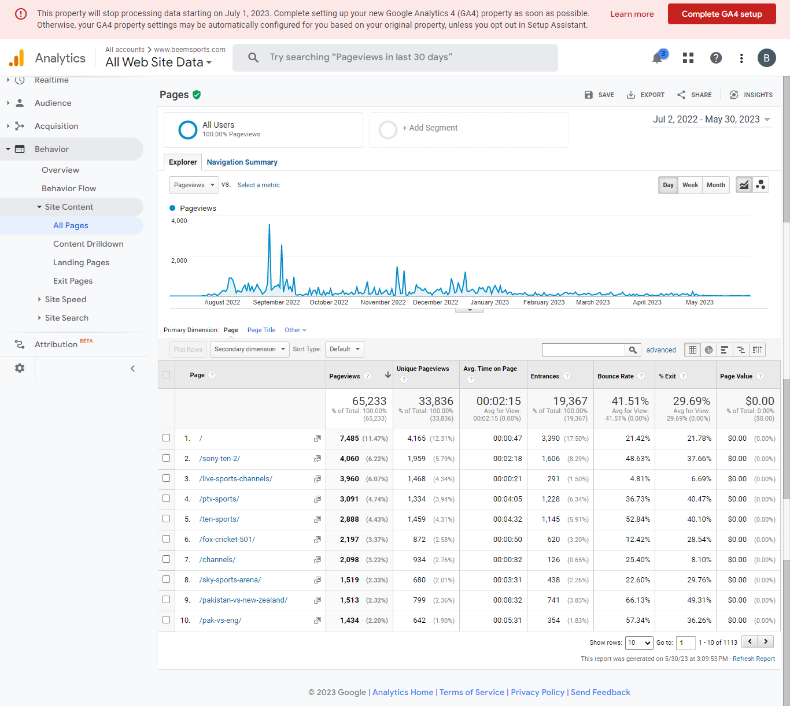
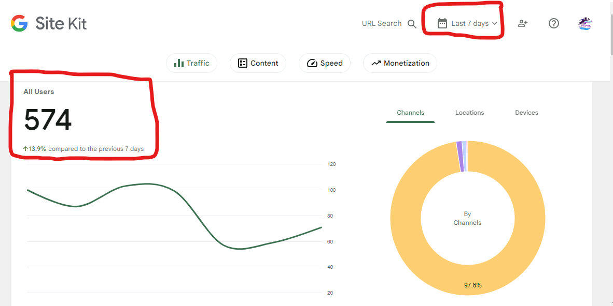
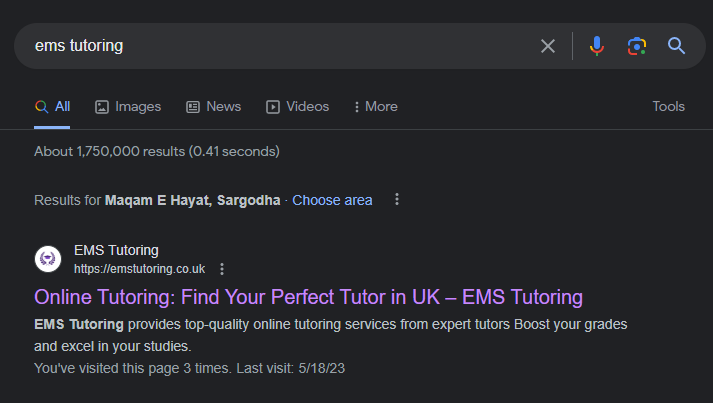
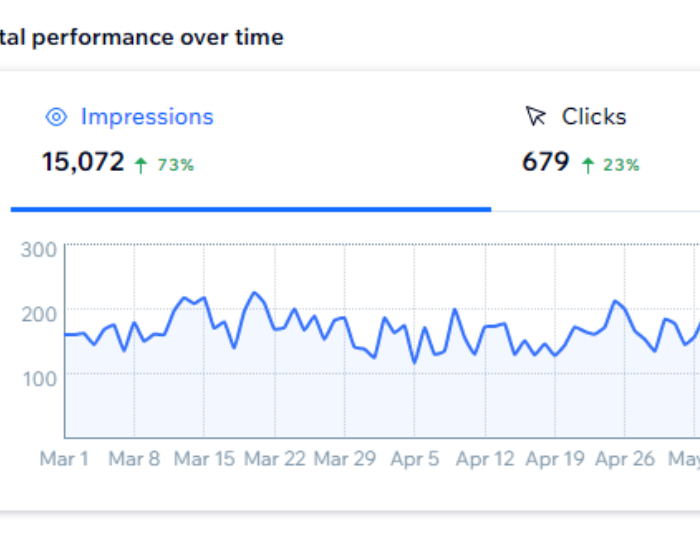
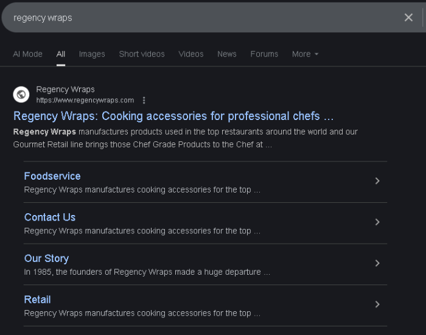

# 🌐 SEO & Web Development Portfolio – Sohaib Younas  

Welcome to my portfolio repository!  
Here I showcase my **SEO expertise, full-stack development skills, and real client projects** with results and case studies.  

---

## 👨‍💻 About Me  

I’m **Sohaib Younas**, a **Full Stack Web Developer & SEO Specialist** with experience in:  

- 💻 **Web Development:** HTML5, CSS3, Bootstrap 5, PHP, SQL, JavaScript  
- 🖥 **CMS & Platforms:** WordPress, Shopify, Wix  
- 🎨 **Design Tools:** Figma, Canva  
- 📈 **SEO Expertise:**  
  - On-Page SEO (Meta tags, content, schema, internal linking)  
  - Off-Page SEO (Backlinks, guest posting, citations)  
  - Technical SEO (Page speed, crawlability, indexation)  
  - Keyword Research & Competitor Analysis  
  - SEO Audits & Reporting  

⚡ My goal is to build **optimized websites** that rank higher, drive organic traffic, and grow businesses.  

---

## 🛠 Skills & Tools  

- **Web Development:** `HTML5` · `CSS3` · `Bootstrap` · `PHP` · `SQL`  
- **CMS Platforms:** `WordPress` · `Shopify` · `Wix`  
- **Design Tools:** `Figma` · `Canva`  
- **SEO Tools:** `Google Analytics` · `Google Search Console` · `Ahrefs` · `SEMrush` · `Screaming Frog`  

---

## 📊 Featured Projects  

### 🔹 Project – Beem Sports (Live Sports Streaming Website)  

<p align="center">
  
  
</p>  
<br>
<p align="center">
  
</p>  

**Description:**  
I worked on the **SEO of Beem Sports**, a live sports streaming platform.  
Initially, the website was not even ranking on **Google’s first page**, but through my SEO strategies it achieved **top rankings** for multiple high-traffic keywords.  

**Key Achievements:**  
- 🚀 Ranked the website on **Google 1st Page** for competitive sports keywords  
- 📈 Achieved **65,000+ pageviews** within the campaign (as shown in Google Analytics)  
- 🔑 Improved visibility and organic reach for **cricket & live sports keywords**  
- ⚡ Enhanced **user engagement** by reducing bounce rate and improving session time  

This project demonstrates my ability to **take a website from zero visibility to strong organic performance** with measurable results.


---

📚 Project – EMS Tutoring (Education / Online Tutoring Platform – UK) 

<p align="center">
  
  
</p>  

**Description:**  
Description:
I worked on the SEO of EMS Tutoring, an online tutoring platform in the UK.
Initially, the website had very low visibility and was not appearing on Google’s first page. Through a complete SEO strategy (on-page optimization, off-page backlinks, and keyword research), the website achieved 1st-page rankings for tutoring-related keywords and started generating consistent traffic.

Key Achievements:

🚀 Ranked the website on Google’s 1st Page for multiple educational and tutoring keywords

📈 Reached 574+ users in the last 7 days (as shown in analytics)

🔑 Improved visibility in the UK tutoring market with targeted keyword strategy

⚡ Achieved 13.9% weekly growth in traffic compared to the previous period

🎯 Strengthened brand credibility by optimizing site structure, schema, and local SEO

👉 This project highlights my expertise in growing an education niche website from low visibility to measurable organic performance with consistent growth.

---

### 🔹 🍴 Project – Regency Wraps (Foodservice & Gourmet Retail)

<p align="center">
  
  
</p>  

Description:
I worked on the SEO and digital growth strategy for Regency Wraps, a leading manufacturer of chef-grade cooking accessories. Despite being an established brand since 1985, their website had low visibility and wasn’t generating the online traffic it deserved. Through a mix of technical SEO, keyword targeting, and content authority building, I delivered measurable results within just 1 week.

Key Achievements (in 1 week):

🚀 Boosted search visibility by +73% impressions in Google Search

📈 Increased qualified organic clicks by +23%

🔑 Ranked for high-intent commercial keywords like “professional chef wraps” & “gourmet cooking products”

⚡ Strengthened site authority with optimized technical SEO and valuable backlinks

🎯 Built a strong digital presence for both B2B (foodservice) and B2C (direct-to-chef retail) customers

👉 This project demonstrates my ability to take a well-known offline brand and grow its digital visibility & lead generation through SEO-driven strategies in a very short time.  

---

## 📂 Repository Structure  

```bash
SEO-Portfolio/
│
├── screenshots/        # All project screenshots
├── reports/            # SEO reports & audits
└── README.md           # Documentation file
```

---

## 📬 Connect with Me  

- ✉️ Email: **sohaibyounas076@gmail.com** 
- 🌐 Portfolio: [My Portfolio](https://sohaibyounas076.github.io/portfolio/)  
- 💼 LinkedIn: [Sohaib Younas](https://linkedin.com/in/sohaibyounas076)  
- 🛠 GitHub: [@sohaibyounas076](https://github.com/sohaibyounas076)  

---

✨ *Thank you for visiting my SEO & Web Development portfolio. I look forward to collaborating on impactful projects!*  
